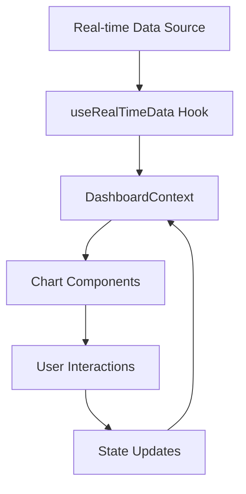

# Chart Data Structures Documentation

Tài liệu này mô tả tất cả các cấu trúc dữ liệu được sử dụng bởi các chart components trong hệ thống SEO Controller.

## 📊 Tổng quan

Hệ thống sử dụng các chart components chính sau:
- **TopicCloud**: Word cloud hiển thị trending topics
- **TrendChart**: Biểu đồ xu hướng theo thời gian
- **SentimentChart**: Biểu đồ phân tích sentiment
- **CompetitorChart**: Biểu đồ so sánh đối thủ cạnh tranh
- **DataTable**: Bảng dữ liệu nội dung

## 🏗️ Cấu trúc dữ liệu chính

### RealTimeData Interface

```typescript
interface RealTimeData {
  timestamp: number
  metrics: {
    sov: number                    // Share of Voice (%)
    sentiment: number              // Sentiment score (-1 to 1)
    mentions: number               // Total mentions
    engagement: number             // Engagement rate (%)
  }
  trends: TrendData[]              // Time series data
  sentiment: SentimentData[]       // Sentiment distribution
  competitors: CompetitorData[]    // Competitor analysis
  topics: TopicData[]              // Trending topics
  content: ContentData[]           // Content performance
}
```

## 📈 Chart Components Data Structures

### 1. TopicCloud Component

#### TopicData Interface
```typescript
interface TopicData {
  text: string                     // Topic text/keyword
  value: number                    // Frequency/weight value
  sentiment?: number               // Sentiment score (-1 to 1)
  confidence?: number              // Analysis confidence (0-1)
  trend?: 'rising' | 'falling' | 'stable'  // Trend direction
  mentions?: number                // Number of mentions
  engagement?: number              // Engagement rate
}
```

#### TopicCloudProps Interface
```typescript
interface TopicCloudProps {
  title: string                    // Chart title
  data: TopicData[]                // Array of topic data
  animation?: 'word-cloud' | 'fade-in'     // Animation type
  interaction?: 'click-filter' | 'hover-only'  // Interaction mode
  onTopicClick?: (topic: TopicData) => void   // Click callback
}
```

**Ví dụ dữ liệu:**
```json
[
  {
    "text": "artificial intelligence",
    "value": 45,
    "sentiment": 0.7,
    "confidence": 0.85,
    "trend": "rising",
    "mentions": 1250,
    "engagement": 12.5
  },
  {
    "text": "machine learning",
    "value": 38,
    "sentiment": 0.6,
    "confidence": 0.78,
    "trend": "stable",
    "mentions": 980,
    "engagement": 10.2
  }
]
```

### 2. TrendChart Component

#### TrendData Interface
```typescript
interface TrendData {
  date: string                     // Date in ISO format
  mentions: number                 // Number of mentions
  sentiment: number                // Average sentiment score
}
```

#### TrendChartProps Interface
```typescript
interface TrendChartProps {
  title: string                    // Chart title
  data: TrendData[]                // Time series data
  animation?: 'line-draw' | 'fade-in'      // Animation type
  interaction?: 'zoom-pan' | 'hover-only'  // Interaction mode
}
```

**Ví dụ dữ liệu:**
```json
[
  {
    "date": "2024-01-01",
    "mentions": 150,
    "sentiment": 0.3
  },
  {
    "date": "2024-01-02",
    "mentions": 180,
    "sentiment": 0.4
  }
]
```

### 3. SentimentChart Component

#### SentimentData Interface
```typescript
interface SentimentData {
  name: string                     // Sentiment category
  value: number                    // Percentage value
  color: string                    // Hex color code
  [key: string]: any               // Additional properties
}
```

#### SentimentChartProps Interface
```typescript
interface SentimentChartProps {
  title: string                    // Chart title
  data: SentimentData[]            // Sentiment distribution data
  animation?: 'pie-reveal' | 'fade-in'     // Animation type
  interaction?: 'hover-details' | 'click-slice'  // Interaction mode
}
```

**Ví dụ dữ liệu:**
```json
[
  {
    "name": "Positive",
    "value": 45.2,
    "color": "#10b981"
  },
  {
    "name": "Neutral",
    "value": 35.8,
    "color": "#6b7280"
  },
  {
    "name": "Negative",
    "value": 19.0,
    "color": "#ef4444"
  }
]
```

### 4. CompetitorChart Component

#### CompetitorData Interface
```typescript
interface CompetitorData {
  brand: string                    // Brand/competitor name
  sov: number                      // Share of Voice percentage
  color: string                    // Brand color
}
```

#### CompetitorChartProps Interface
```typescript
interface CompetitorChartProps {
  title: string                    // Chart title
  data: CompetitorData[]           // Competitor data
  animation?: 'bar-stack' | 'fade-in'      // Animation type
  interaction?: 'drill-down' | 'hover-only'  // Interaction mode
}
```

**Ví dụ dữ liệu:**
```json
[
  {
    "brand": "Our Brand",
    "sov": 26.2,
    "color": "#3b82f6"
  },
  {
    "brand": "Competitor A",
    "sov": 18.5,
    "color": "#ef4444"
  },
  {
    "brand": "Competitor B",
    "sov": 15.3,
    "color": "#10b981"
  }
]
```

### 5. DataTable Component

#### ContentData Interface
```typescript
interface ContentData {
  id: number                       // Unique identifier
  title: string                    // Content title
  platform: string                 // Platform name
  engagement: number               // Engagement rate
  reach: number                    // Reach/impressions
}
```

#### DataTableProps Interface
```typescript
interface DataTableProps {
  title: string                    // Table title
  data: ContentData[]              // Content data array
  animation?: 'row-reveal' | 'fade-in'     // Animation type
  interaction?: 'sort-filter' | 'read-only'  // Interaction mode
}
```

**Ví dụ dữ liệu:**
```json
[
  {
    "id": 1,
    "title": "AI Revolution in Healthcare",
    "platform": "LinkedIn",
    "engagement": 8.5,
    "reach": 12500
  },
  {
    "id": 2,
    "title": "Future of Machine Learning",
    "platform": "Twitter",
    "engagement": 12.3,
    "reach": 8900
  }
]
```

## 🎯 Trend Analysis Data Structures

### TrendTopic Interface
```typescript
interface TrendTopic {
  id: string                       // Unique topic ID
  name: string                     // Topic name
  volume: number                   // Mention volume
  delta: number                    // Change from previous period
  confidence: number               // Analysis confidence
  sentiment: {
    positive: number               // Positive sentiment %
    neutral: number                // Neutral sentiment %
    negative: number               // Negative sentiment %
  }
  platforms: string[]              // Platforms where topic appears
  keywords: string[]               // Related keywords
  samplePosts: TrendPost[]         // Sample posts
  createdAt: Date                  // Creation timestamp
}
```

### TrendPost Interface
```typescript
interface TrendPost {
  id: string                       // Post ID
  title: string                    // Post title
  content: string                  // Post content
  canonicalUrl: string             // Post URL
  platform: string                 // Platform name
  author: string                   // Author name
  publishedAt: Date                // Publication date
  metrics: {
    likes: number                  // Like count
    shares: number                 // Share count
    comments: number               // Comment count
    views: number                  // View count
  }
  sentiment: {
    label: 'positive' | 'neutral' | 'negative'  // Sentiment label
    score: number                  // Sentiment score
  }
}
```

### TrendHashtag Interface
```typescript
interface TrendHashtag {
  id: string                       // Hashtag ID
  hashtag: string                  // Hashtag text
  volume: number                   // Usage volume
  engagementRate: number           // Engagement rate
  samplePosts: string[]            // Sample post IDs
  platforms: string[]              // Platforms
}
```

## 🏢 Project & Brand Data Structures

### Project Interface
```typescript
interface Project {
  id: string                       // Project ID
  name: string                     // Project name
  description: string              // Project description
  brands: Brand[]                  // Own brands
  competitors: Brand[]             // Competitor brands
  createdAt: Date                  // Creation date
  status: 'active' | 'inactive' | 'processing'  // Project status
}
```

### Brand Interface
```typescript
interface Brand {
  id: string                       // Brand ID
  name: string                     // Brand name
  type: 'own' | 'competitor'       // Brand type
  keywords: string[]               // Brand keywords
  urls: string[]                   // Brand URLs
}
```

## 🔧 Dashboard State Management

### DashboardState Interface
```typescript
interface DashboardState {
  projects: Project[]              // All projects
  selectedProject: string | null   // Currently selected project
  timeRange: string                // Time range filter
  filters: {
    platform: string[]             // Platform filters
    sentiment: string[]             // Sentiment filters
    dateRange: {
      start: Date | null           // Start date
      end: Date | null             // End date
    }
  }
  viewMode: 'grid' | 'list'        // View mode
  sidebarCollapsed: boolean        // Sidebar state
  selectedMetrics: string[]        // Selected metrics
  realTimeData: RealTimeData | null  // Real-time data
  isRealTimeEnabled: boolean       // Real-time toggle
  lastUpdate: Date | null          // Last update time
  error: string | null             // Error message
  showEmptyState: boolean          // Empty state flag
  selectedTopic: any | null        // Selected topic for detail view
}
```

## 📝 Sử dụng dữ liệu

### 1. Mapping dữ liệu cho charts

```typescript
// Ví dụ mapping RealTimeData cho TopicCloud
const topicData: TopicData[] = realTimeData.topics.map(topic => ({
  text: topic.text,
  value: topic.value,
  sentiment: topic.sentiment,
  confidence: topic.confidence,
  trend: topic.trend,
  mentions: topic.mentions,
  engagement: topic.engagement
}))
```

### 2. Filtering và sorting

```typescript
// Filter topics by sentiment
const positiveTopics = topics.filter(topic => 
  topic.sentiment && topic.sentiment > 0.1
)

// Sort by value descending
const sortedTopics = topics.sort((a, b) => b.value - a.value)
```

### 3. Data validation

```typescript
// Validate topic data
const isValidTopic = (topic: TopicData): boolean => {
  return !!(
    topic.text && 
    topic.text.trim().length > 0 && 
    typeof topic.value === 'number' && 
    topic.value > 0
  )
}
```

## 🎨 Animation & Interaction Types

### Animation Types
- `'word-cloud'`: Word cloud animation
- `'fade-in'`: Fade in animation
- `'line-draw'`: Line drawing animation
- `'pie-reveal'`: Pie chart reveal animation
- `'bar-stack'`: Bar chart stacking animation
- `'row-reveal'`: Table row reveal animation

### Interaction Types
- `'click-filter'`: Click to filter/select
- `'hover-only'`: Hover for details only
- `'zoom-pan'`: Zoom and pan interaction
- `'hover-details'`: Hover for detailed tooltip
- `'click-slice'`: Click on chart slice
- `'drill-down'`: Drill down interaction
- `'sort-filter'`: Sort and filter interaction
- `'read-only'`: Read-only mode

## 🔄 Real-time Data Flow



## 📋 Best Practices

1. **Data Validation**: Luôn validate dữ liệu trước khi render
2. **Error Handling**: Xử lý lỗi gracefully với fallback UI
3. **Performance**: Sử dụng memoization cho dữ liệu lớn
4. **Accessibility**: Đảm bảo charts có thể truy cập được
5. **Responsive**: Charts phải responsive trên mọi thiết bị

## 🚀 Mở rộng

Để thêm chart mới:

1. Định nghĩa interface cho data structure
2. Tạo component với props interface
3. Thêm vào RealTimeData interface nếu cần
4. Cập nhật DashboardContext để handle data mới
5. Thêm vào DashboardGrid và MobileDashboard

---

*Tài liệu này được cập nhật thường xuyên. Vui lòng kiểm tra phiên bản mới nhất.*
